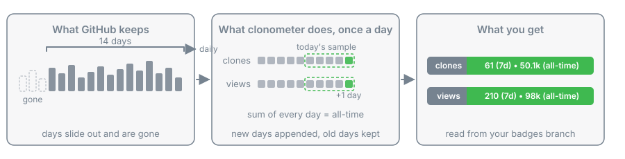

<h1 align="center">📈 clonometer</h1>

<p align="center">
  <b>GitHub forgets your clones after 14 days. clonometer does not.</b>
  <br>
  A lifetime clone count for any repository, in a JSON file you can badge any way you like.
</p>

<p align="center">
  <a href=".github/workflows/ci.yml"></a>
  <a href="https://codecov.io/gh/oficiallyAkshay/clonometer"></a>
  <a href="LICENSE"></a>
  <a href="pyproject.toml"></a>
  <a href="pyproject.toml"></a>
</p>

<p align="center">
  <a href="#limits"></a>
  <a href="#limits"></a>
</p>

<!-- once published, add: https://img.shields.io/npm/dm/clonometer?logo=npm&logoColor=white and https://img.shields.io/pypi/dm/clonometer?logo=pypi&logoColor=white -->

<p align="center"></p>

<p align="center">
  <b><a href="https://github.com/oficiallyAkshay/clonometer/blob/badges/clones.json">See this repository's own numbers file</a></b>
</p>

GitHub only remembers the last 14 days of clone traffic, then the number is gone. clonometer samples that window once a day and keeps the total forever.

## Features

| Feature | What it means |
| --- | --- |
| **Honest numbers** | Never goes down, uniques are never summed across days |
| **Your badge, your way** | Label, colour, style and logo are yours; clonometer ships numbers |
| **Stored on your repo** | The ledger lives on a branch of your own repository, no gist, no other repo |
| **Views too** | One input adds page views beside clones |

## Quick start

1. Write [the workflow](.github/consumer-workflow.yml), pinned to the current commit:

   ```bash
   mkdir -p .github/workflows && curl -fsSL https://raw.githubusercontent.com/oficiallyAkshay/clonometer/main/.github/consumer-workflow.yml | sed "s|<sha>|$(git ls-remote https://github.com/oficiallyAkshay/clonometer.git HEAD | cut -c1-40)|" > .github/workflows/clonometer.yml
   ```

2. Create [a fine-grained token](https://github.com/settings/personal-access-tokens/new) for this repository only, with Administration read and Contents write, and store it as the Actions secret TRAFFIC_TOKEN.

3. Run the workflow once from the Actions tab, then pick a badge below.

## Badges

Every one of these reads this repository's own numbers file; swap in yours.

| Badge | Recipe, with OWNER/REPO in place of this repository |
| --- | --- |
| <a href="https://github.com/oficiallyAkshay/clonometer/blob/badges/clones.json"></a> | `https://img.shields.io/badge/dynamic/json?url=https://raw.githubusercontent.com/OWNER/REPO/badges/clones.json&query=$.badge&label=clones&logo=github&logoColor=white` |
| <a href="https://github.com/oficiallyAkshay/clonometer/blob/badges/views.json"></a> | `https://img.shields.io/badge/dynamic/json?url=https://raw.githubusercontent.com/OWNER/REPO/badges/views.json&query=$.badge&label=views&logo=github&logoColor=white` |
| <a href="https://github.com/oficiallyAkshay/clonometer/blob/badges/clones.json"></a> | `https://img.shields.io/badge/dynamic/json?url=https://raw.githubusercontent.com/OWNER/REPO/badges/clones.json&query=$.total_short&label=clones&suffix=%20all-time&logo=github&logoColor=white` |
| <a href="https://github.com/oficiallyAkshay/clonometer/blob/badges/clones.json"></a> | `https://img.shields.io/badge/dynamic/json?url=https://raw.githubusercontent.com/OWNER/REPO/badges/clones.json&query=$.last7_short&label=clones&suffix=%20this%20week&logo=github&logoColor=white` |
| <a href="https://github.com/oficiallyAkshay/clonometer/blob/badges/clones.json"></a> | `https://img.shields.io/badge/dynamic/json?url=https://raw.githubusercontent.com/OWNER/REPO/badges/clones.json&query=$.badge&label=clones&style=for-the-badge&logo=github` |
| <a href="https://github.com/oficiallyAkshay/clonometer/blob/badges/clones.json"></a> | `https://img.shields.io/badge/dynamic/json?url=https://raw.githubusercontent.com/OWNER/REPO/badges/clones.json&query=$.badge&label=clones&color=6f42c1&logo=github&logoColor=white` |

## Configuration and security

| Input | Default | Meaning |
| --- | --- | --- |
| `token` | required | Fine-grained token with Administration read and Contents write on this repository |
| `branch` | `badges` | Storage branch, always one commit, never your default branch |
| `metrics` | `clones` | `clones` or `clones,views` |

### What leaves your machine

| Concern | What actually happens | The guard |
| --- | --- | --- |
| Where the token goes | One request to the GitHub API and one push to your own repository, nothing else | Redirects are refused, plain http is refused, the token is never in a URL or a log |
| Reading traffic | The action reads the traffic endpoint with the token you provide | A workflow token cannot read traffic, so it is never used |
| The push | One commit lands on the storage branch of your own repository | The default branch is refused, the branch is force pushed to one commit |
| Dependencies | None at runtime | Standard library only, nothing to resolve or audit |
| This repo leaking data | No data belonging to anyone is in this repository | A prose gate and a secrets scan run on every commit in CI |
| Your badge | Shields fetches a public raw file from your storage branch | The file carries counts only, no identity in it |

## How it compares

| | [github-clone-count-badge](https://github.com/MShawon/github-clone-count-badge) | [github-repo-stats](https://github.com/jgehrcke/github-repo-stats) | clonometer |
| --- | --- | --- | --- |
| Lifetime count | Yes | Yes | Yes |
| One line in a workflow | No, paste its workflow | Yes | Yes |
| Where the data lives | A gist | A data branch of whichever repository runs it, this one by default | A branch of this repository |
| What you get | One badge | Reports and charts | Numbers files, any badge |
| Counts views too | No | Yes | Yes |
| Token needs | Traffic, plus gist write | Traffic, plus push to the repository that runs it | Traffic, plus push to this repository |

## Limits

- Counting starts the day you enable it, plus the 14 days GitHub still had; nothing older is recoverable.
- Clones include bots and CI, and GitHub's figures arrive about a day late.
- Uniques are per day and never added up.
- A private repository keeps counting, but the badge renders only once it is public.
- A day GitHub later revises downwards keeps its highest sample, so the total can only overstate, never understate.
- Run it daily and keep the concurrency group; past 13 days rows are lost, and two runs at once would race.
- The install line pins whatever commit main is at that moment; read it before trusting it.

## For agents

| Key | Type | Meaning |
| --- | --- | --- |
| `schema` | int | Always `1` |
| `repo` | string | `owner/name` the numbers belong to |
| `metric` | string | `clones` or `views` |
| `since` | date | The earliest day in the ledger, UTC |
| `updated` | date | The day this file was written, UTC |
| `window.days` | int | Always `14`, the size of GitHub's window |
| `window.count` | int | GitHub's own count for the window, as reported this run |
| `window.uniques` | int | GitHub's own uniques for the window |
| `last7`, `last7_short` | int, string | Sum of the ledger's counts over the last seven days, so it never goes down, and its short form |
| `total`, `total_short` | int, string | Sum of every day's count in the ledger, and its short form: `1,234`, `12.3k`, `1.2M` |
| `window_short` | string | `window.count` in the same short form |
| `badge` | string | Seven days, a bullet, all time, in short form, ready for one badge |

| File on the storage branch | Holds |
| --- | --- |
| `clones.json`, `clones-ledger.json` | The numbers file above and its ledger |
| `views.json`, `views-ledger.json` | The same for views, when views are on |

```json
{"schema": 1, "repo": "owner/name", "since": "2026-09-17", "days": {"2026-09-17": {"count": 12, "uniques": 9}}}
```

Merge: each day's fields become the larger of the ledger's value and the new one, no day is ever removed. Guard: a lifetime total below the previous run's is refused and nothing is written.

```
clonometer OWNER/NAME [--write DIR] [--branch badges] [--metrics clones|clones,views]
uvx --from git+https://github.com/oficiallyAkshay/clonometer clonometer owner/name
```

| Variable or exit | Meaning |
| --- | --- |
| `CLONOMETER_TOKEN` | The token; `GITHUB_TOKEN` is read when it is unset and can never work |
| `CLONOMETER_API` | API root override for tests, https only, default `https://api.github.com` |
| exit `0` or `1` | Numbers printed or files written, read-only without `--write`; or one line on stderr and nothing written |

What CI runs and the test plan a change must satisfy: [CONTRIBUTING](.github/CONTRIBUTING.md).
