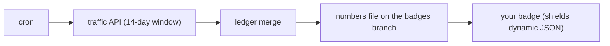

<h1 align="center">📈 clonometer</h1>

<p align="center">
  <b>GitHub forgets your clones after 14 days. clonometer does not.</b>
  <br>
  A lifetime clone count for any repository, in a JSON file you can badge any way you like.
</p>

<p align="center">
  <a href=".github/workflows/ci.yml"></a>
  <a href="https://codecov.io/gh/oficiallyAkshay/clonometer"></a>
  <a href="LICENSE"></a>
  
  
</p>

<!-- once published, add: https://img.shields.io/npm/dm/clonometer?logo=npm&logoColor=white and https://img.shields.io/pypi/dm/clonometer?logo=pypi&logoColor=white -->



GitHub only remembers the last 14 days of clone traffic, then the number resets to zero. clonometer samples that window on a schedule and keeps the total forever.

```json
{
  "metric": "clones",
  "repo": "owner/name",
  "schema": 1,
  "since": "2026-09-17",
  "total": 50123,
  "total_short": "50.1k",
  "updated": "2026-10-01",
  "window": {
    "count": 123,
    "days": 14,
    "uniques": 45
  },
  "window_short": "123"
}
```

## Features

| Feature | What it means |
| --- | --- |
| **Lifetime count** | Every clone since day one, not just the last 14 |
| **Your badge, your way** | Label, colour, style and logo are yours; clonometer ships numbers |
| **Honest numbers** | Never goes down, uniques are never summed across days |
| **Stored on your repo** | The ledger lives on a branch of your own repo |
| **Zero dependencies** | Standard library only, nothing to install or audit |
| **Views optional** | Turn on page views alongside clones with one input |
| **Private repos count** | Counting continues privately, the badge renders once you go public |

## Quick start

```yaml
name: clonometer
on:
  schedule: [{cron: "17 3 * * *"}]
  workflow_dispatch:
permissions: {}
concurrency: {group: clonometer}
jobs:
  count:
    runs-on: ubuntu-latest
    steps:
      - uses: oficiallyAkshay/clonometer@<sha>   # pinned commit
        with:
          token: ${{ secrets.TRAFFIC_TOKEN }}
```

Then badge it however you like:

```
https://img.shields.io/badge/dynamic/json?url=https://raw.githubusercontent.com/OWNER/REPO/badges/clones.json&query=$.total_short&label=clones&suffix=%20all-time&logo=github&logoColor=white
https://img.shields.io/badge/dynamic/json?url=https://raw.githubusercontent.com/OWNER/REPO/badges/clones.json&query=$.window.count&label=clones&suffix=%20in%2014%20days
```

The token is a fine-grained PAT with Administration read and Contents write on that repository only, with an expiry, stored as the secret `TRAFFIC_TOKEN`.

## How it works

1. A scheduled workflow runs once a day.
2. It reads the 14 day traffic window from the GitHub API.
3. Each day's counts merge into the ledger, keeping the higher value.
4. The ledger and a small numbers file are pushed to the `badges` branch.
5. Your README badge reads the numbers file through shields, or anything else that reads JSON.

## Configuration and security

| Input | Default | Meaning |
| --- | --- | --- |
| `token` | required | Fine-grained PAT with Administration read and Contents write on this repository |
| `branch` | `badges` | Orphan storage branch |
| `metrics` | `clones` | `clones` or `clones,views` |

### What leaves your machine: one authenticated request to api.github.com and one push to your own repository, nothing else

| Concern | What actually happens | The guard |
| --- | --- | --- |
| Reading traffic | The action reads the clones endpoint with the token you provide | A workflow token cannot read traffic, so `GITHUB_TOKEN` is never used here |
| The push | One commit lands on the storage branch of your own repository | The branch is force pushed, so it never grows past that one commit |
| The token | Sits in your repository's secrets | Sent only to `api.github.com` and `github.com`, never written to a log |
| Dependencies | None at runtime | Standard library only, nothing to resolve or audit |
| This repo leaking data | No data belonging to anyone is in this repository | A prose gate and a secrets scan run on every commit in CI |
| Your badge | Shields fetches a public raw file from your storage branch | The file carries counts only, no identity in it |

## Local check

Once published, `pipx run clonometer owner/name` and `npx clonometer owner/name` print the window and the lifetime for any repository your token can read traffic on, without writing anything.

## How it compares

| | Copy-paste workflow templates | Central stats repositories | Registry download badges | clonometer |
| --- | --- | --- | --- | --- |
| Lifetime count | No, 14 days only | Yes | No | Yes |
| One `uses:` line | No, paste the workflow yourself | No | Yes | Yes |
| Data lives with the repo | Yes | No | No | Yes |
| Badge shape is yours | No | No | No | Yes |
| Needs an extra repo or gist | No | Yes | No | No |
| Counts views too | No | Sometimes | No | Yes |

Prior art: [MShawon/github-clone-count-badge](https://github.com/MShawon/github-clone-count-badge) copies clones into a gist with a workflow template, and [jgehrcke/github-repo-stats](https://github.com/jgehrcke/github-repo-stats) reports into a central stats repository.

## Limits

- Counting starts the day you enable it, plus the 14 days GitHub still had; nothing older is recoverable.
- Clones include bots and CI.
- Uniques are per day and never added up.
- A private repo keeps counting, but the badge renders only once the repo is public.
- A PAT is required because a workflow token cannot read traffic.
- Run it daily; anything past 13 days loses rows.
